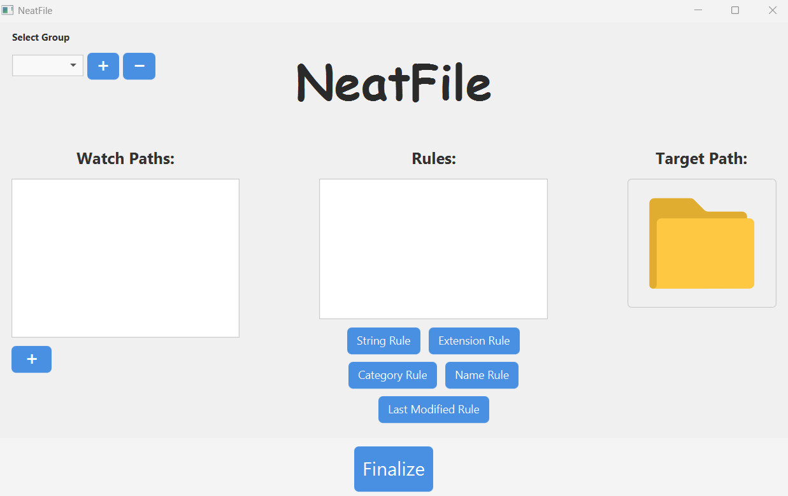

# NeatFile - Smart Desktop Organizer

NeatFile is a JavaFX desktop application that helps you automatically organize files from specified folders into destination directories based on custom rules. It's a user-friendly, flexible, and visually interactive tool for file management.

---

## Features

- **Group-based organization**
  - Each group has its own watch directories, rules, and target directory.
- **Flexible rule types**
  - Organize files based on:
    - File extension
    - File name content
    - File content (text within files)
    - File category (image, document, audio, video)
    - Last modified date
- **Simple UI**
  - Add watch folders and rules with buttons.
  - Click to remove them
- **Conflict detection**
  - Prevents duplicate or conflicting groups.
- **Manual scanning**
  - Automatically scans every 5 seconds for new files.

---

## How to Use

### 1. Launching the App
- Make sure you have Java 17 or later installed.
- Download the latest release ZIP file from the GitHub repository - [download here](https://github.com/frankthegamer/CSI_2300_Project/releases/download/v1.0/NeatFile.zip)
- Extract the contents of the ZIP file to a convenient location.
- Double click the `run.bat` file. Because the program is unrecognized, your system may display a pop-up saying "Windows protected your PC", click "run anyways".
- The main window will appear with three sections: Watch Paths, Rules, and Target Path.

### 2. Creating a Group
- Click the "+" button near the dropdown to create a new group.
- The app will auto-select the new group.
- If already created, the first group will be selected on startup.

### 3. Adding Watch Paths
- Click the small "+" button under the Watch Paths section.
- Choose a folder to watch. You can add multiple.

### 4. Setting a Target Directory
- Click the folder icon under "Target Path".
- Select the folder where matching files should be moved.
- The label updates to show the folder name, with a tooltip for the full path.

### 5. Adding Rules
- Choose from several rule buttons:
  - **Extension Rule:** Move files with certain extensions.
  - **String Rule:** Move files containing specific text.
  - **Category Rule:** Move based on general file type.
  - **Name Rule:** Match keywords in file names.
  - **Last Modified Rule:** Move files modified more than a number of days.

### 6. Finalizing
- Click the **"Finalize"** button at the bottom.
- This saves your groups and rules to `groups.json`.
- A small popup will confirm that your changes were saved.

---

## Important Notes

- Conflicting groups (with same watch dirs, rules and different target) are not saved to `groups.json` after finalizing; they will have to be removed first.
- If a file with the same name already exists in the target folder, the new one is renamed.
- Any changes must be finalized before exiting the application to save them.

---

## Requirements

- Java 17+
- JavaFX SDK (included in the release bundle)
- Additional libraries (included in lib folder)
- Windows Operating System

---

## Project Structure
```
NeatFile/
├── lib/                            # Required jar libraries (POI, PDFBox, JSON, etc.)
│   ├── poi-5.2.3.jar
│   ├── poi-ooxml-5.2.3.jar
│   ├── poi-ooxml-full-5.2.3.jar
│   ├── xmlbeans-5.1.1.jar
│   ├── commons-collections4-4.4.jar
│   ├── commons-compress-1.21.jar
│   ├── commons-io-2.13.0.jar
│   ├── commons-logging-1.2.jar
│   ├── pdfbox-2.0.27.jar
│   ├── fontbox-2.0.27.jar
│   ├── log4j-api-2.17.2.jar
│   ├── log4j-core-2.17.2.jar
│   └── json-20250107.jar
│
├── src/
│   ├── organizer/
│   │   ├── NeatFileApp.java       # Main class
│   │   ├── NeatFileLogic.java
│   │   ├── NeatGroup.java
│   │   ├── style.css
│   │   └── folder_icon.png
│   │
│   └── organizer/rule/
│       ├── Rule.java
│       ├── FileExtensionRule.java
│       ├── StringContainedRule.java
│       ├── FileCategoryRule.java
│       ├── NameHasRule.java
│       └── LastModifiedRule.java
│
├── NeatFile.jar                   
├── run.bat                                   
├── README.md                      
├── ui_preview.png                
├── class_diagram.png              
└── javafx-sdk-24/                 
    ├── lib/
    │   ├── javafx.controls.jar
    │   ├── javafx.fxml.jar
    │   ├── javafx.graphics.jar
    │   ├── javafx.base.jar
    │   └── ... (other JavaFX modules)
    └── bin/
        └── *.dll
```
---

## UI Preview



---

## Credits

Created by Frank Richter as a final project for CSI 2300

---
